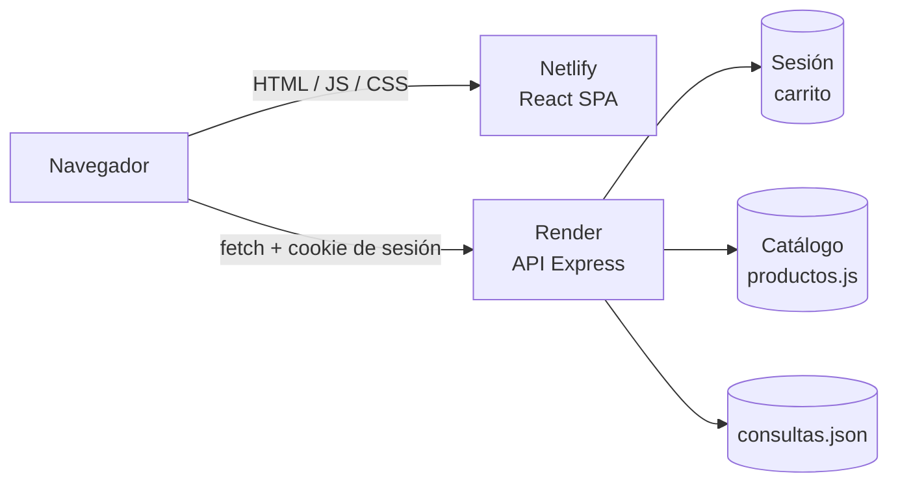

# Mueblería Hermanos Jota

Aplicación web para una mueblería, sprint 3 y 4: catálogo de productos, detalle de cada pieza, carrito de compras y formulario de contacto.
Integrantes
P1 - Ramiro Berruezo (B3RZVS)
P2 - Augusto Freire (Guss-dev-py)
P3 - Agustin Rivero (AgussN1T)
P4 - Ezequiel Monterichel (equiezel)

| | URL |
|---|---|
| **Frontend** (Netlify) | https://quiet-douhua-d3c51b.netlify.app/ |
| **API** (Render) | https://muebleria-hermanos-jota-ygmi.onrender.com |

> La API está en el plan gratuito de Render: si estuvo un rato sin uso, la primera petición puede tardar unos segundos mientras el servicio se "despierta".

---

## Tabla de contenidos

1. [Funcionalidades](#funcionalidades)
2. [Stack tecnológico](#stack-tecnológico)
3. [Estructura del proyecto](#estructura-del-proyecto)
4. [Requisitos](#requisitos)
5. [Instalación y ejecución local](#instalación-y-ejecución-local)
6. [Variables de entorno](#variables-de-entorno)
7. [API REST](#api-rest)
8. [Arquitectura y decisiones técnicas](#arquitectura-y-decisiones-técnicas)
9. [Despliegue](#despliegue)
10. [Limitaciones conocidas y mejoras futuras](#limitaciones-conocidas-y-mejoras-futuras)

---

## Funcionalidades

- Catálogo de productos con listado y vista de detalle (especificaciones, materiales, medidas).
- Carrito de compras: agregar, cambiar cantidad, quitar y vaciar. Se mantiene entre visitas mediante sesión.
- Formulario de contacto con validación en el servidor.
- Navegación SPA con rutas: `/`, `/productos`, `/productos/:id` y `/contacto`.

## Stack tecnológico

| Capa | Tecnologías |
|---|---|
| **Backend** | Node.js, Express 5, `express-session`, `cors`, `dotenv`, `http-errors` (ES Modules) |
| **Frontend** | React 19, TypeScript, Vite, React Router 7, TanStack Query 5, react-icons |
| **Despliegue** | Render (API) y Netlify (frontend) |

## Estructura del proyecto

Monorepo con dos aplicaciones independientes, cada una con su propio `package.json`:

```
MuebleriaHnosJota_FullStack/
├── backend/
│   ├── server.js                 # Punto de entrada: carga .env y levanta el servidor
│   ├── .env.example              # Plantilla de variables de entorno
│   └── src/
│       ├── app.js                # Configuración de Express, CORS, sesión y rutas
│       ├── routes/               # Definición de endpoints (productos, carrito, contacto)
│       ├── controllers/          # Validan la entrada y arman la respuesta HTTP
│       ├── services/             # Lógica de negocio (carrito, productos)
│       ├── repositories/         # Acceso a datos (catálogo, carrito en sesión, consultas)
│       ├── middlewares/          # logger, sesión, validación de contacto, 404 y errores
│       └── data/productos.js     # Catálogo de productos
└── client/
    ├── public/_redirects         # Fallback de la SPA para Netlify
    └── src/
        ├── views/                # Pantallas: Home, Productos, ProductoDetails
        ├── components/           # Navbar, Footer, ProductCard, ProductList, ContactForm
        ├── cart/                 # Contexto, componentes, API y tipos del carrito
        ├── hooks/                # Hooks de React Query para productos
        ├── services/             # Llamadas fetch a la API
        ├── types/                # Tipos de TypeScript
        └── utils/                # URL de la API y formato de precios
```

## Requisitos

- **Node.js 20.19 o superior** (o 22.12+). Lo exige Vite 8 en el frontend; el backend funciona desde Node 18.
- **npm** (incluido con Node).
- Git.

## Instalación y ejecución local

Hay que levantar **ambos servidores** en dos terminales distintas.

### 1. Clonar el repositorio

```bash
git clone https://github.com/B3RZVS/MuebleriaHnosJota_FullStack.git
cd MuebleriaHnosJota_FullStack
```

### 2. Backend (puerto 3000)

```bash
cd backend
npm install
cp .env.example .env      # en Windows (PowerShell): copy .env.example .env
npm run dev               # con recarga automática (nodemon)
```

Para correrlo sin recarga automática: `npm start`.

Si todo salió bien, la consola muestra `Servidor escuchando en http://localhost:3000`. Podés comprobarlo abriendo http://localhost:3000/api/productos.

### 3. Frontend (puerto 5173)

En otra terminal, desde la raíz del repositorio:

```bash
cd client
npm install
npm run dev
```

Abrí http://localhost:5173. Sin configuración adicional, el cliente apunta a `http://localhost:3000`.

### Otros comandos del frontend

| Comando | Qué hace |
|---|---|
| `npm run build` | Chequea tipos (`tsc -b`) y genera el build de producción en `client/dist` |
| `npm run preview` | Sirve localmente el build generado |
| `npm run lint` | Ejecuta ESLint |

## Variables de entorno

### Backend (`backend/.env`)

| Variable | Obligatoria | Descripción |
|---|---|---|
| `PORT` | No (default `3000`) | Puerto del servidor. Render lo inyecta automáticamente. |
| `CLIENT_ORIGIN` | No en local, **sí en producción** | Origen(es) del frontend autorizados por CORS, separados por coma. Sin `/` al final. Ej: `https://quiet-douhua-d3c51b.netlify.app` |
| `SESSION_SECRET` | **Sí si `NODE_ENV=production`** | Texto largo y secreto para firmar la cookie de sesión. |
| `NODE_ENV` | En producción | Debe ser `production` para activar la cookie segura. |

Si `CLIENT_ORIGIN` no está definida, se permiten `http://localhost:5173` y `http://127.0.0.1:5173`.

### Frontend (`client/.env`)

| Variable | Obligatoria | Descripción |
|---|---|---|
| `VITE_API_URL` | No en local, **sí en producción** | URL base del backend, sin `/` al final. Por defecto `http://localhost:3000`. |

> Vite incorpora las variables `VITE_*` **durante el build**. Si cambiás `VITE_API_URL`, hay que volver a desplegar el frontend.

## API REST

Base URL: `http://localhost:3000` (local) o la URL de Render (producción).

### Productos

| Método | Ruta | Descripción |
|---|---|---|
| `GET` | `/api/productos` | Lista todos los productos |
| `GET` | `/api/productos/:id` | Detalle de un producto (`404` si no existe) |

### Carrito

El carrito pertenece a la sesión del visitante, por lo que las peticiones deben enviarse con cookies (`credentials: 'include'`). Todas las respuestas devuelven el carrito completo: `{ items, totalItems, total }`.

| Método | Ruta | Cuerpo | Descripción |
|---|---|---|---|
| `GET` | `/api/carrito` | — | Obtiene el carrito actual |
| `POST` | `/api/carrito/items` | `{ productoId, cantidad? }` | Agrega un producto (cantidad por defecto: 1) |
| `PATCH` | `/api/carrito/items/:productoId` | `{ cantidad }` | Cambia la cantidad de un ítem |
| `DELETE` | `/api/carrito/items/:productoId` | — | Quita un ítem |
| `DELETE` | `/api/carrito` | — | Vacía el carrito |

### Contacto

| Método | Ruta | Cuerpo | Descripción |
|---|---|---|---|
| `POST` | `/api/contacto` | `{ nombre, email, mensaje }` | Registra una consulta. Responde `202`. Nombre de al menos 3 caracteres, email válido y mensaje no vacío; si no, `400`. |

### Formato de errores

Los errores se devuelven como JSON: `{ "mensaje": "..." }`. En errores `5xx` el mensaje es genérico para no exponer detalles internos.

## Arquitectura y decisiones técnicas



### Backend en capas

El backend separa responsabilidades en cuatro capas: **routes → controllers → services → repositories**.

- **Routes**: solo declaran qué ruta llama a qué controlador.
- **Controllers**: validan la entrada (tipos, cantidades) y traducen el resultado a HTTP.
- **Services**: contienen las reglas de negocio, como calcular subtotales y totales o verificar que el producto exista.
- **Repositories**: son el único lugar que sabe de dónde salen los datos.

Hoy los datos viven en un array en memoria, en la sesión y en un archivo JSON. Gracias a esta separación, migrar a una base de datos implica modificar solo la capa de repositories.

### Carrito en la sesión del servidor

El carrito se guarda en la sesión (`express-session`) y no en el navegador. Esto evita implementar login para un caso de uso que no lo necesita y mantiene los precios bajo control del servidor: el cliente envía solo `productoId` y `cantidad`, y el backend calcula precios y totales a partir del catálogo.

### Cookies entre dominios distintos

Frontend (Netlify) y API (Render) están en dominios diferentes, así que la cookie de sesión es *cross-site*. Para que el navegador la envíe en producción:

- `sameSite: 'none'` y `secure: true` en la cookie.
- `proxy: true`, porque Render termina el HTTPS antes de llegar a Express.
- CORS con `credentials: true` y una lista explícita de orígenes (no `*`).
- `credentials: 'include'` en los `fetch` del carrito.
- En local se usa `sameSite: 'lax'` y `secure: false`, porque ahí no hay HTTPS.

### Seguridad básica

- La app **no arranca** en producción sin `SESSION_SECRET`.
- La cookie es `httpOnly` y expira a las 24 horas.
- Los errores 500 no revelan el mensaje original.
- Las entradas del carrito y del formulario de contacto se validan en el servidor.

### Frontend

- **TanStack Query** gestiona la carga de productos (estados de carga, error y reintentos). Se configuró con un solo reintento para que los errores aparezcan rápido.
- **Context API** maneja el estado del carrito, que es global a toda la aplicación.
- La respuesta del carrito se **valida en tiempo de ejecución** (`esCarrito`) antes de usarla, para que un formato inesperado produzca un error claro y no una pantalla rota.
- La URL de la API se centraliza en `utils/urls.ts` y se configura con `VITE_API_URL`.
- Un hook por recurso (`useProductosApi`, `useProductoApi`) mantiene los componentes simples.

### Imágenes

Las imágenes de los productos se sirven desde un repositorio aparte publicado con GitHub Pages, lo que mantiene este repo liviano y evita servir archivos estáticos desde la API.

## Despliegue

### Backend en Render

1. Crear un **Web Service** y conectar el repositorio.
2. Configurar:

   | Campo | Valor |
   |---|---|
   | Root Directory | `backend` |
   | Build Command | `npm install` |
   | Start Command | `npm start` |

3. Agregar las variables de entorno:

   ```
   NODE_ENV=production
   SESSION_SECRET=<texto largo y aleatorio>
   CLIENT_ORIGIN=https://quiet-douhua-d3c51b.netlify.app
   ```

   `PORT` lo asigna Render automáticamente. `CLIENT_ORIGIN` va sin barra final: CORS compara el origen de forma exacta.

### Frontend en Netlify

1. Crear un sitio nuevo desde el repositorio.
2. Configurar:

   | Campo | Valor |
   |---|---|
   | Base directory | `client` |
   | Build command | `npm run build` |
   | Publish directory | `client/dist` |

3. Agregar la variable de entorno:

   ```
   VITE_API_URL=https://muebleria-hermanos-jota-ygmi.onrender.com
   ```

4. El archivo `client/public/_redirects` (`/* /index.html 200`) hace que recargar o entrar directo a rutas como `/productos/aparador-uspallata` funcione en lugar de dar 404.

### Orden recomendado

1. Desplegar primero el backend y copiar su URL.
2. Desplegar el frontend con esa URL en `VITE_API_URL`.
3. Volver a Render y completar `CLIENT_ORIGIN` con la URL de Netlify.

## Limitaciones conocidas y mejoras futuras

- **Carrito no persistente ante reinicios**: la sesión se guarda en la memoria del servidor (store por defecto de `express-session`), por lo que se pierde cuando Render reinicia o duerme el servicio. Una mejora natural es usar un store externo (por ejemplo Redis).
- **Consultas de contacto en archivo local**: se guardan en `backend/src/data/consultas.json` (ignorado por git). El disco de Render es efímero, así que se borran en cada despliegue. Lo adecuado sería una base de datos o un servicio de email.
- **Catálogo fijo**: los productos están hardcodeados en `data/productos.js`; no hay panel de administración ni base de datos.
- **Cookies de terceros**: al ser cross-site, algunos navegadores (por ejemplo Safari, o Chrome con bloqueo de cookies de terceros) pueden impedir que el carrito se mantenga. Servir frontend y API bajo un mismo dominio lo resolvería.
- **Sin checkout ni pagos**: el carrito no llega a una instancia de compra.
- **Sin tests automatizados.**

---

